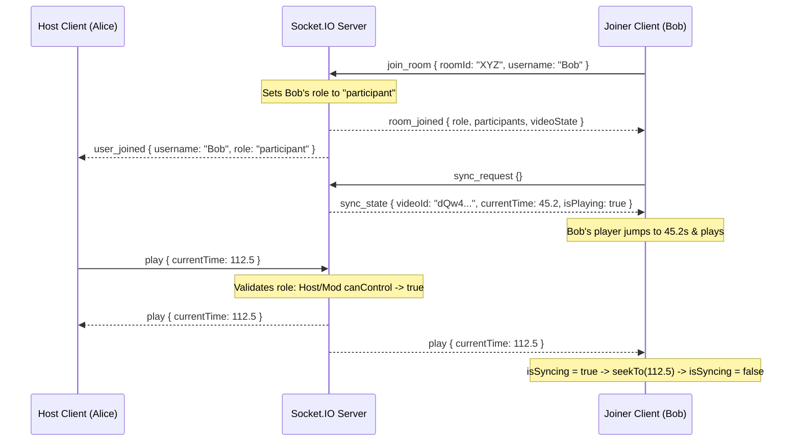

# SyncTube 🎬

Watch YouTube videos together in real time. Rooms, roles, sync, and chat — all included.

[](https://react.dev/)
[](https://vite.dev/)
[](https://tailwindcss.com/)
[](https://nodejs.org/)
[](https://socket.io/)
[](https://opensource.org/licenses/MIT)

---

## Live Demo

🔗 **Live Link:** [https://synctube-ss.vercel.app](https://synctube-ss.vercel.app/)

---

## ✨ Features

*   **Create or Join Rooms:** Instant generation of a unique 6-character room code or shared link.
*   **Real-time Playback Sync:** Play, pause, scrub, seek, and video source changes stay in lockstep across all participants.
*   **Granular Role-Based Access Control (RBAC):**
    *   **Host:** Full control (playback, changing videos, promoting/demoting moderators, kicking participants, voluntary host transfer).
    *   **Moderator:** Access to play, pause, seek, and load new videos.
    *   **Participant:** Watch-only mode; playback controls are disabled and interactions are blocked.
*   **Robust Host Lifecycles:**
    *   **Manual Transfer:** Hand over host privileges voluntarily from the user list context menu.
    *   **Auto Transfer:** Automatically promotes the next oldest participant if the current host disconnects.
*   **Interactive Features:** Real-time chat messaging with dynamic scroll-to-bottom and entrance animations.
*   **Late-Joiner Synchronization:** New joiners auto-fetch the current host's video ID, state, and timeline offset.
*   **YouTube Input Parsing:** Supports full YouTube URLs, `youtu.be` shortened links, mobile `/shorts/`, or raw video IDs.
*   **Visual Error Indicators:** Gracefully handles invalid, private, deleted, or embed-restricted YouTube videos with toast notifications.

---

## 📂 Directory Structure & Key Files

```text
syncTube/
├── client/                     # Frontend Application (React + Vite + TailwindCSS v4)
│   ├── src/
│   │   ├── components/
│   │   │   ├── room/
│   │   │   │   ├── Chat.jsx            # Live chat panel with message bubbles
│   │   │   │   ├── Controls.jsx        # Play/pause toggle and seek-debounced slider
│   │   │   │   ├── ParticipantList.jsx # Sidebar showing users, roles, and host actions
│   │   │   │   ├── RoomHeader.jsx      # Top navbar containing room code and leave button
│   │   │   │   └── VideoPlayer.jsx     # YouTube IFrame player wrapper & event listener
│   │   │   └── Loader.jsx              # Pulsing rings, skeleton loaders, and entry states
│   │   ├── context/
│   │   │   └── RoomContext.jsx         # Client-side room state provider & socket subscriptions
│   │   ├── hooks/
│   │   │   ├── useRoom.js              # Shorthand hook to access RoomContext
│   │   │   └── useYouTubePlayer.js     # Manages YT IFrame scripts injection and instances
│   │   ├── pages/
│   │   │   ├── Home.jsx                # Splash/Landing page for the SaaS interface
│   │   │   ├── Lobby.jsx               # Navigation page to create/join rooms
│   │   │   ├── Room.jsx                # Active watch party dashboard
│   │   │   └── NotFound.jsx            # 404 page redirect
│   │   ├── App.jsx                     # Route paths and toast configuration
│   │   ├── index.css                   # Custom stylesheets and Tailwind CSS v4 variables
│   │   ├── main.jsx                    # React bootstrap entrypoint
│   │   └── socket.js                   # Single socket.io client singleton
│   ├── .env                            # Client environment variables (local)
│   ├── .env.production                 # Client environment variables (production)
│   └── package.json
├── server/                     # Backend API (Node.js + Express + Socket.IO)
│   ├── socket/
│   │   ├── index.js                    # WebSockets registration entrypoint
│   │   ├── roomSocket.js               # Enforces roles and handles playback synchronization
│   │   └── chatSocket.js               # Relays chat events to socket rooms
│   ├── utils/
│   │   ├── roomId.js                   # Unique room identifier generator
│   │   └── roomStore.js                # Shared in-memory active rooms state object
│   ├── server.js                       # HTTP server and CORS configuration
│   ├── .env                            # Server environment variables (local)
│   └── package.json
└── README.md
```

---

## 🛠️ Local Installation & Development

### 1. Clone the Repository

```bash
git clone https://github.com/SahilSameer18/syncTube.git
cd syncTube
```

### 2. Configure Environment Variables

Create [server/.env](file:///c:/Users/HP/Desktop/syncTube/server/.env):
```env
PORT=3000
CLIENT_URL=http://localhost:5173
```

Create [client/.env](file:///c:/Users/HP/Desktop/syncTube/client/.env):
```env
VITE_SERVER_URL=http://localhost:3000
```

### 3. Install Dependencies & Launch Dev Servers

Open two terminal sessions to run both servers concurrently:

#### Terminal 1: Backend Server
```bash
cd server
npm install
npm run dev
```
*Server running on [http://localhost:3000](http://localhost:3000)*

#### Terminal 2: Frontend Client
```bash
cd client
npm install
npm run dev
```
*Frontend running on [http://localhost:5173](http://localhost:5173)*

---

## 🛟 Troubleshooting Local Run

*   **Port Conflicts:** If port `3000` is already in use on your machine, edit `PORT` in `server/.env` and update `VITE_SERVER_URL` in `client/.env` accordingly.
*   **CORS Blocked Errors:** Make sure `CLIENT_URL` in your server `.env` matches the exact URL of your client dev server (usually `http://localhost:5173`).
*   **Video Playback Fails to Sync:**
    *   Ensure the video URL paste is public. Embeds for private videos will fail.
    *   Verify that your browser does not block YouTube scripts or cookies.

---

## 🏗️ Synchronization Mechanics & Flow



### Echo Loop Prevention
When the backend sends a synchronization event (e.g. `play` or `pause`), the local player fires an `onStateChange` listener. To prevent this change from triggering a new socket emit back to the server (an infinite sync loop), the client context sets an `isSyncing = true` ref block, which briefly suppresses outgoing events during synchronization transitions.

### Seek Debouncing
Instead of sending a `seek` event to all users during every slider movement, client-side seeking uses a local state tracker. The `seek` event is only emitted to the socket room once the user releases the slider bar (`onMouseUp` / `onTouchEnd`).

---

## 🔌 WebSocket API Reference

The following events are registered in the server's socket architecture:

| Event | Direction | Payload Shape | Description |
| :--- | :--- | :--- | :--- |
| `join_room` | Client ➔ Server | `{ roomId: string, username: string }` | Joins a room. First joiner becomes `host`; subsequent joiners become `participant`. |
| `leave_room` | Client ➔ Server | `void` | Leaves the room manually. Triggers cleanup or auto-host promotion. |
| `play` | Client ➔ Server | `{ currentTime: number }` | Emits play state. Requires `host` or `moderator` privileges. |
| `play` | Server ➔ Clients | `{ currentTime: number }` | Syncs play state to all clients in the room. |
| `pause` | Client ➔ Server | `{ currentTime: number }` | Emits pause state. Requires `host` or `moderator` privileges. |
| `pause` | Server ➔ Clients | `{ currentTime: number }` | Syncs pause state to all clients in the room. |
| `seek` | Client ➔ Server | `{ time: number }` | Emits video scrubber update. Requires `host` or `moderator` privileges. |
| `seek` | Server ➔ Clients | `{ time: number }` | Syncs timeline seek position to all clients. |
| `change_video` | Client ➔ Server | `{ videoId: string }` | Initiates source change. Requires `host` or `moderator` privileges. |
| `change_video` | Server ➔ Clients | `{ videoId: string }` | Loads a new video source for all clients. |
| `sync_request` | Client ➔ Server | `void` | Requests the current playback state (used by late joiners). |
| `sync_state` | Server ➔ Client | `{ videoId: string, currentTime: number, isPlaying: boolean }` | Sends current state to the requesting client only. |
| `assign_role` | Client ➔ Server | `{ targetUserId: string, role: string }` | Assigns `moderator` or `participant` role to target. Host only. |
| `transfer_host`| Client ➔ Server | `{ targetUserId: string }` | Passes host status to the target participant. Host only. |
| `remove_participant` | Client ➔ Server | `{ targetUserId: string }` | Kicks a participant from the room. Host only. |
| `chat_message` | Client ➔ Server | `{ message: string }` | Sends a message to the room chat. |
| `chat_message` | Server ➔ Clients | `{ userId: string, username: string, message: string, timestamp: number }` | Relays message to all clients in the room. |
| `room_joined` | Server ➔ Client | `{ roomId: string, role: string, participants: Array, videoState: Object }` | Confirms room join. |
| `user_joined` | Server ➔ Clients | `{ userId: string, username: string, role: string, participants: Array }` | Notifies room of a new joiner. |
| `user_left` | Server ➔ Clients | `{ userId: string, username: string, newHostId: string/null, participants: Array }` | Notifies room of user disconnect/leave. |
| `role_assigned`| Server ➔ Clients | `{ userId: string, role: string, participants: Array }` | Notifies room of role promotions/demotions. |
| `participant_removed` | Server ➔ Clients | `{ userId: string, participants: Array }` | Notifies room of user kick. |
| `removed_from_room` | Server ➔ Client | `void` | Sent to a kicked client instructing them to leave immediately. |

---

## 🚀 Future Roadmap & Scaling

1.  **OOP Encapsulation:** Refactor socket handles using Object-Oriented Programming (e.g., dedicated `Room`, `Participant`, and `PlaybackHandler` classes) to encapsulate verification and states.
2.  **Horizontal Scaling:** Support hundreds of concurrent rooms with multiple server instances using a load balancer and the [Socket.IO Redis Adapter](https://socket.io/docs/v4/redis-adapter/).
3.  **Database Persistence:** Transition rooms from volatile server memory to a database (e.g., PostgreSQL or MongoDB) for persistent session state storage.
4.  **Security & Auth:** Restrict room creation to registered accounts using token-based session authentication.
