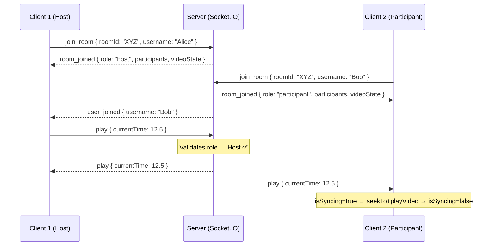

# SyncTube 🎬

Watch YouTube videos together in real time. Rooms, roles, sync, and chat — all included.

## Live Demo

🔗 **Live Link:** [https://synctube-ss.vercel.app](https://synctube-ss.vercel.app/)

---

## Features

- **Create or join a room** with a 6-character room code or a shared room link
- **Real-time sync** — play, pause, seek, and change video stay in sync for all participants
- **Role system** — Host, Moderator, Participant
  - Host has full control: playback, change video, assign roles, remove participants, transfer host
  - Moderators can control playback and change the video
  - Participants can only watch
- **Manual host transfer** — Host can voluntarily pass the Host role to any participant
- **Auto host transfer** — if the host leaves, the next person in the room becomes host automatically
- **Live chat** inside each room
- **Toast notifications** for join/leave/role/kick events
- **Late joiner sync** — joining an active room catches you up to the current video state
- **YouTube error feedback** — invalid, private, or embed-blocked videos show a clear error message
- **Supports all YouTube URL formats** — full URLs, `youtu.be` short links, `/shorts/`, or bare video IDs

---

## Tech Stack

| Layer     | Tech                           |
| --------- | ------------------------------ |
| Frontend  | React 19, Vite, TailwindCSS v4 |
| Backend   | Node.js, Express 5             |
| Real-time | Socket.IO                      |
| Video     | YouTube IFrame API             |
| Storage   | In-memory (no database needed) |

---

## Directory Structure

```text
syncTube/
├── client/                     # Frontend (React + Vite)
│   ├── src/
│   │   ├── components/         # Chat, Controls, ParticipantList, VideoPlayer, Loader
│   │   ├── context/            # RoomContext — global room state
│   │   ├── hooks/              # useYouTubePlayer — YT IFrame API wrapper
│   │   ├── pages/              # Home, Room, NotFound
│   │   ├── App.jsx             # Routes & Toast provider
│   │   ├── index.css           # Global styles & Tailwind design tokens
│   │   ├── main.jsx            # React entry point
│   │   └── socket.js           # Singleton Socket.IO client
│   ├── .env                    # Local env (VITE_SERVER_URL=http://localhost:3000)
│   ├── .env.production         # Production env (VITE_SERVER_URL=https://...onrender.com)
│   └── package.json
├── server/                     # Backend (Node.js + Express)
│   ├── socket/
│   │   ├── index.js            # Socket.IO connection entry point
│   │   ├── roomSocket.js       # All room events (join, play, pause, seek, roles, etc.)
│   │   └── chatSocket.js       # Chat message events
│   ├── utils/
│   │   ├── roomStore.js        # Shared in-memory room state object
│   │   └── roomId.js           # 6-character room code generator
│   ├── server.js               # Express + Socket.IO server setup
│   ├── .env                    # Local env (CLIENT_URL=http://localhost:5173)
│   └── package.json
└── README.md
```

---

## Local Setup

### 1. Clone the repo

```bash
git clone https://github.com/SahilSameer18/syncTube.git
cd syncTube
```

### 2. Install dependencies

```bash
# backend
cd server && npm install

# frontend
cd ../client && npm install
```

### 3. Environment variables

Create `server/.env`:

```env
PORT=3000
CLIENT_URL=http://localhost:5173
```

Create `client/.env`:

```env
VITE_SERVER_URL=http://localhost:3000
```

### 4. Run locally

```bash
# Terminal 1 — backend
cd server
npm run dev

# Terminal 2 — frontend
cd client
npm run dev
```

Open [http://localhost:5173](http://localhost:5173)

---

## Architecture



### How WebSockets enable sync

Every playback action (play, pause, seek, change video) follows this flow:

1. **Client emits** an event to the server (e.g. `play { currentTime: 12.5 }`)
2. **Server validates** the sender's role — Participants are rejected server-side
3. **Server updates** the shared in-memory `videoState` for the room
4. **Server broadcasts** the event to all sockets in the room
5. **Each client applies** the change to their YouTube IFrame player

An `isSyncing` ref in `VideoPlayer.jsx` prevents echo loops — when a server event is applied to the local player, the player fires `onStateChange`, but `isSyncing = true` suppresses the re-emit back to the server.

### Seek debouncing

The seek slider uses **local state** while dragging. The socket event is only emitted when the user **releases** the slider (`onMouseUp` / `onTouchEnd`), preventing event flooding.

### Role system

```
Host        → full control (playback + change video + assign roles + remove + transfer host)
Moderator   → playback + change video
Participant → watch only (controls disabled in UI and rejected server-side)
```

Roles are enforced **on the server** in `roomSocket.js` — not just the UI. Even if a client sends a `play` event manually, the server will reject it if the sender's role is `participant`.

### Host transfer

- **Auto:** When the host disconnects or leaves, the server auto-promotes the first remaining participant and broadcasts the updated participant list with `user_left { newHostId }`.
- **Manual:** The host can click ⋯ → **Make Host** next to any participant. The server handles `transfer_host`, demotes the old host to `participant`, and emits `role_assigned` to update all clients.

---

## Deployment

### Current deployment

| Service | Platform | URL |
| ------- | -------- | --- |
| Frontend | Vercel | [synctube-ss.vercel.app](https://synctube-ss.vercel.app/) |
| Backend | Render | [synctube-tdv8.onrender.com](https://synctube-tdv8.onrender.com) |

### Environment variables — production

| Location | Variable | Value |
| -------- | -------- | ----- |
| Render dashboard | `CLIENT_URL` | `https://synctube-ss.vercel.app` |
| Vercel dashboard | `VITE_SERVER_URL` | `https://synctube-tdv8.onrender.com` |

> `client/.env.production` is committed and is picked up automatically by Vite during `npm run build`.  
> Server env vars must be set in the Render dashboard (not from the `.env` file).

---

## WebSocket Events

| Event                 | Direction        | Payload                                    |
| --------------------- | ---------------- | ------------------------------------------ |
| `join_room`           | Client → Server  | `{ roomId, username }`                     |
| `leave_room`          | Client → Server  | —                                          |
| `play`                | Both             | `{ currentTime }`                          |
| `pause`               | Both             | `{ currentTime }`                          |
| `seek`                | Both             | `{ time }`                                 |
| `change_video`        | Both             | `{ videoId }`                              |
| `sync_request`        | Client → Server  | —                                          |
| `sync_state`          | Server → Client  | `{ videoId, currentTime, isPlaying }`      |
| `assign_role`         | Client → Server  | `{ targetUserId, role }`                   |
| `transfer_host`       | Client → Server  | `{ targetUserId }`                         |
| `remove_participant`  | Client → Server  | `{ targetUserId }`                         |
| `chat_message`        | Both             | `{ userId, username, message, timestamp }` |
| `room_joined`         | Server → Client  | `{ roomId, role, participants, videoState }` |
| `user_joined`         | Server → Clients | `{ userId, username, role, participants }` |
| `user_left`           | Server → Clients | `{ userId, username, newHostId, participants }` |
| `role_assigned`       | Server → Clients | `{ userId, role, participants }`           |
| `participant_removed` | Server → Clients | `{ userId, participants }`                 |
| `removed_from_room`   | Server → Client  | —                                          |

---

Developed by: Sahil Sameer Siddique
