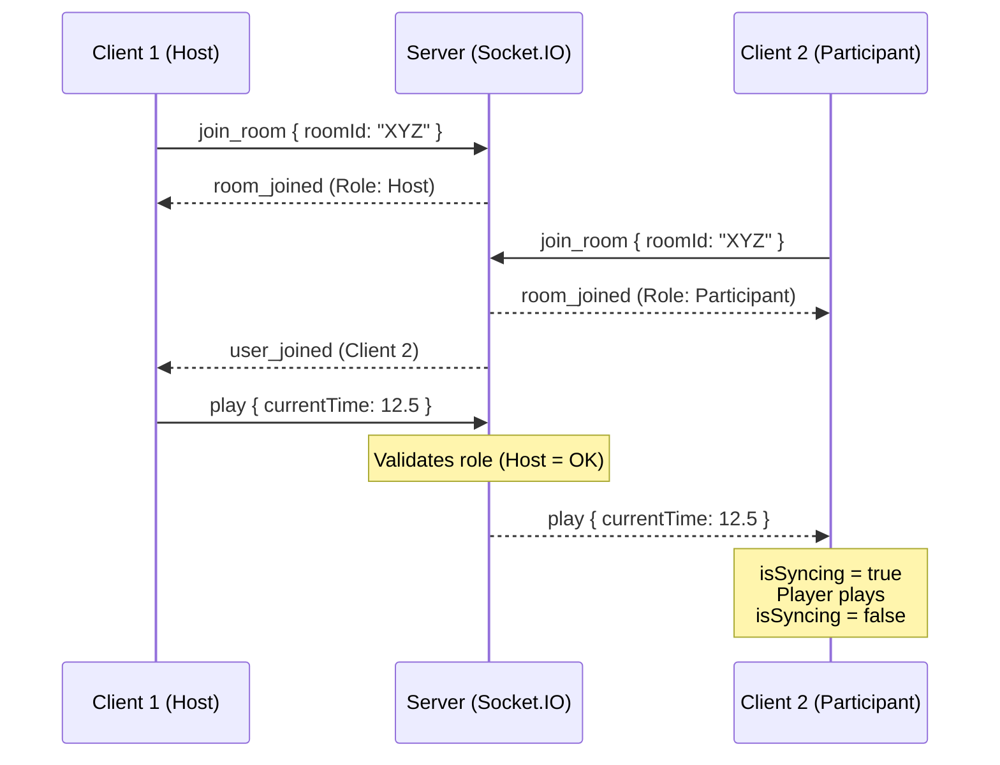

# SyncTube 🎬

Watch YouTube videos together in real time. Rooms, roles, sync, and chat — all included.

## Live Demo

🔗 **Live Link:** [https://synctube-ss.vercel.app](https://synctube-ss.vercel.app/)


---

## Features

- **Create or join a room** with a 6-character room code or a shared room link
- **Real-time sync** — play, pause, seek, and change video stay in sync for everyone
- **Role system** — Host, Moderator, Participant
  - Host can assign roles and remove participants
  - Moderators can control playback and change the video
  - Participants can only watch
- **Live chat** inside each room
- **Playback controls** — play, pause, and seek are available for authorized users
- **Toast notifications** for join/leave/role events
- **Late joiner sync** — joining an active room catches you up to the current video state
- **Auto host transfer** — if the host leaves, the next person becomes host automatically

---

## Tech Stack

| Layer     | Tech                           |
| --------- | ------------------------------ |
| Frontend  | React 19, Vite, TailwindCSS v4 |
| Backend   | Node.js, Express 5             |
| Real-time | Socket.IO                      |
| Video     | YouTube IFrame API             |
| Storage   | In-memory (no database needed) |

---

## Directory Structure

```text
syncTube/
├── client/                     # Frontend App (React + Vite)
│   ├── src/
│   │   ├── components/         # UI Elements (Chat, Controls, ParticipantList, Loader)
│   │   ├── context/            # RoomState Context Provider (RoomContext.jsx)
│   │   ├── hooks/              # Custom React Hooks (useYouTubePlayer.js)
│   │   ├── pages/              # App Pages (Home, Room, NotFound)
│   │   ├── App.jsx             # React Routes & Toast Providers
│   │   ├── index.css           # Global Styles & Tailwind Tokens
│   │   ├── main.jsx            # React App Entry Point
│   │   └── socket.js           # Client Socket.IO instance
│   └── package.json
├── server/                     # Backend App (Node.js + Express)
│   ├── socket/                 # WebSockets Handlers (roomSocket, chatSocket)
│   ├── utils/                  # In-Memory Storage & Unique Code Generator
│   ├── server.js               # Express + Socket.IO Server Configuration
│   └── package.json
└── README.md
```

---

## Local Setup

### 1. Clone the repo

```bash
git clone https://github.com/your-username/syncTube.git
cd syncTube
```

### 2. Install dependencies

```bash
# server
cd server
npm install

# client
cd ../client
npm install
```

### 3. Environment variables

Create `server/.env`:

```env
PORT=3000
CLIENT_URL=http://localhost:5173
```

Create `client/.env`:

```env
VITE_SERVER_URL=http://localhost:3000
```

### 4. Run locally

```bash
# terminal 1 — backend
cd server
npm run dev

# terminal 2 — frontend
cd client
npm run dev
```

Open http://localhost:5173

---

## Architecture

Create `server/.env`:

```env
PORT=3000
CLIENT_URL=http://localhost:5173
```

Create `client/.env`:

```env
VITE_SERVER_URL=http://localhost:3000
```

### 4. Run locally

```bash
# terminal 1 — backend
cd server
npm run dev

# terminal 2 — frontend
cd client
npm run dev
```

Open http://localhost:5173

---

## Architecture



### How WebSockets enable sync

Every playback action (play, pause, seek, change video) is:

1. Emitted by the client to the server via a socket event
2. Validated server-side (role check)
3. Broadcast to all other sockets in the same room
4. Applied by each client's YouTube IFrame player

An `isSyncing` ref in `VideoPlayer.jsx` prevents echo loops — when we apply a server event to the player, the player fires `onStateChange`, but we suppress that re-emit.

### Role system

```
Host        → full control (playback + roles + remove participants)
Moderator   → playback + change video
Participant → watch only (controls disabled in UI + rejected server-side)
```

Roles are enforced on the **server** in `roomSocket.js`, not just the UI.

---

## Deployment

### Render (recommended for both)

**Server:**

1. Create a new Web Service and connect the repo
2. Set the root directory to `server`
3. Build command: `npm install`
4. Start command: `npm start`
5. Add env var: `CLIENT_URL=https://your-client.onrender.com`

**Client:**

1. Create a new Static Site and connect the repo
2. Set the root directory to `client`
3. Build command: `npm run build`
4. Publish directory: `dist`
5. Add env var: `VITE_SERVER_URL=https://your-server.onrender.com`

---

## WebSocket Events

| Event                 | Direction        | Payload                                    |
| --------------------- | ---------------- | ------------------------------------------ |
| `join_room`           | Client → Server  | `{ roomId, username }`                     |
| `leave_room`          | Client → Server  | —                                          |
| `play`                | Both             | `{ currentTime }`                          |
| `pause`               | Both             | `{ currentTime }`                          |
| `seek`                | Both             | `{ time }`                                 |
| `change_video`        | Both             | `{ videoId }`                              |
| `sync_request`        | Client → Server  | —                                          |
| `sync_state`          | Server → Client  | `{ videoId, currentTime, isPlaying }`      |
| `assign_role`         | Client → Server  | `{ targetUserId, role }`                   |
| `remove_participant`  | Client → Server  | `{ targetUserId }`                         |
| `chat_message`        | Both             | `{ userId, username, message, timestamp }` |
| `role_assigned`       | Server → Clients | `{ userId, role, participants }`           |
| `participant_removed` | Server → Clients | `{ userId, participants }`                 |

---

Developed by: Sahil Sameer Siddique
